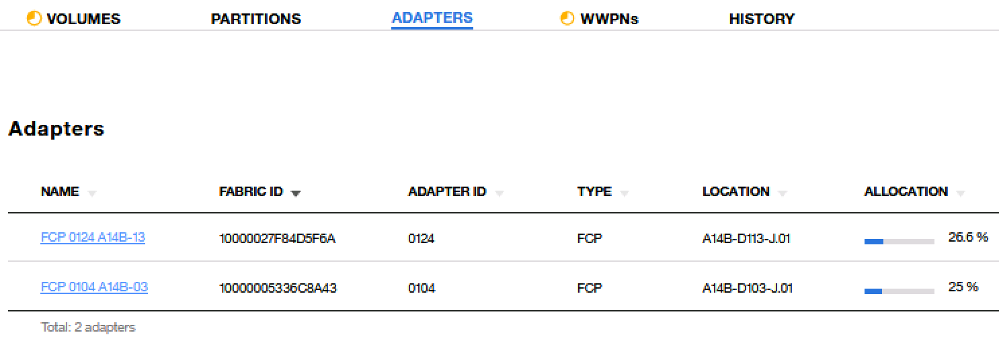

# LinuxONE DPM3.1+TS3500实施手册
_2019年11月4日_  

## 环境准备
* 操作系统
Suse12 Sp4
* 带库
IBM System Storage TS3500 Tape Library,  LTO Ultrium-6

- - - -

> DMP3.1默认没有实现对带库设备的识别.需要在HMC里进行手工的配置并执行一段python代码来正确识别带库设备. 请参照接下来的内容进行操作.  

## HMC操作
* 创建HMC账号
登录 acsadmin, 增加一个新的账号,如tapeuser,带有如下权限:

为新用户增加权限:
	*  Configure Storage - Storage Administrator 
	*  Configure Storage - System Programmer 的权限
* 为新用户(tapeuser)增加remote api权限


* 创建一个Storage Group, 并添加一块任意大小的boot盘.
* 将Storage Group分配给LPAR

## 编辑Python脚本
在附件里可以找到一个名为 attach_tape.py 的脚本
脚本需要修改的地方:
```
# 设定HMC的IP地址
hmc_address = "172.16.31.232"           
# 设定账号
hmc_userid = "tapeuser"
# 设定密码
hmc_password = "password"
# 设定CPC名字
cpc_name = 'BZ13'                    
# 设定Storage Group的UUID,具体UUID获取方式请参考后面截图
storage_group_uuid_customer = "38382ee2-b85d-11e9-81f0-00106f23eea9" 

# 设定HBA卡的UUID,具体UUID获取方式请参考后面截图. 这里是一个数组
# 具体数量以HBA数量为准
adapter_port_list = ['1A424A76-9C8D-11E9-A962-00106F23EEA9',
                     '18F97270-9C8D-11E9-A962-00106F23EEA9',]
```

通过如下方式获取Storage Group的UUID:


通过如下方式获取HBA卡的UUID:


## 运行脚本
在python环境下,执行 attach_tape.py
执行成功后,可以在storage group里看到HBA已经正确识别.
如果执行成功,注意不要再次重复执行该脚本.
以下样例使用的是两块HBA卡的识别情况.


- - - -

> 接下来介绍连接IBM带库需要用到哪些软件, 以及下载方式.  

## 连接IBM带库设备的Linux on Z需要安装的驱动及工具
* lin_tape
lin_tape功能
	* 带库驱动
	* Basic operation to tape (save / restore)
	* Tape media exchange operation (mount / unmount)
* in_taped (error diagnostic daemon)
lin_taped功能
	* Error log and trace
	* Automatic writing of tape drive dumps, log data, etc.
	* Failover and Load Balancing
	* 加密
* ITDT(IBM Tape Diagnostic Tool)
ITDT功能
	* Recognize supported tape drives and tape libraries
	* Tape drive diagnostics
	* Dump from tape drive and tape library
	* Performance measurement
	* Acquisition of cartridge usage status

## lin_tape 驱动下载
* 从Fix Central下载驱动  
[http://www.ibm.com/support/fixcentral/](http://www.ibm.com/support/fixcentral/) 
下载下面两个文件(建议下载最新版)：
	* lin_tape-x.xx.x-x.src.rpm (lin_tape驱动)
	* lin_taped-x.xx.x-sles11.s390x.rpm (lin_taped daemon)
::请注意下载for s390x的::

* 下载方法步骤
	* Product Selector:	 System Storage
	* System Storage:  Tape Systems
	* Tape Systems :  Tape drivers and software
	* Tape drivers and software:  Tape device drivers 
	* Platform:  Linux, 64-bit zSeries 
	选择对应操作系统版本,比如sles12,下载:
		* lin_tape-x.xx.x-x.src.rpm
		* lin_taped-x.xx.x-sles11.s390x.rpm
	* ITDT工具可以一起下载下来 
		* install_itdt_se_Linuxs390x_xxx
* lin_tape 驱动编译说明
lin_tape 驱动是以source rpm的方式提供，需要针对安装环境build以后方可安装，进行rpmbuild的环境需要满足：
	* 同样的操作系统，同样的内核版本 
	* 安装同样版本的kernel-devel，kernel-default-devel包
	* 使用下面命令build rpm包：
		* rpmbuild --rebuild  lin_tape-3.0.39-1.src.rpm 
		* 完成的rpm包位于_usr_src_packages_RPMS/s390x
		* Build出来的rpm包可用于相同操作系统相同内核版本的lin_tape驱动安装

- - - -

> Tape 驱动和工具安装步骤  

## Tape 驱动和工具安装步骤(1) 
```
lin_tape安装前准备
# cp -p /etc/modprobe.d/10-unsupported-modules.conf /etc/modprobe.d/10-unsupported-modules.conf.bk
# vi /etc/modprobe.d/10-unsupported-modules.conf
# cat /etc/modprobe.d/10-unsupported-modules.conf
…
allow_unsupported_modules 1
```

::allow_unsuported_modules设置为1::
::缺省值为0，表示只有包含在安装DVD中的kernel module才能load，改为1，则其它module可以load。::

## Tape 驱动和工具安装步骤(2) 
```
lin_tape驱动rebuild
# rpmbuild --rebuild lin_tape-3.0.39-1.src.rpm

lin_tape驱动安装
# rpm -ivh /usr/src/packages/RPMS/s390x/lin_tape-3.0.39-1.s390x.rpm
Preparing...                ########################################### [100%]
   1:lin_tape               ########################################### [100%]
Starting lin_tape: FATAL: module '/lib/modules/4.4.140-94.42-default/kernel/drivers/scsi/lin_tape.ko' is unsupported
Use --allow-unsupported or set allow_unsupported_modules to 1 in
/etc/modprobe.d/unsupported-modules
lin_tape loaded
```

## Tape驱动和工具安装步骤(3) 
lin_taped daemon安装
```
lin_taped 安装
# rpm -ivh lin_taped-3.0.39-sles12.s390x.rpm
Preparing...                ########################################### [100%]
   1:lin_taped              ########################################### [100%]
Starting lin_tape: FATAL: module '/lib/modules/4.4.140-94.42-default/kernel/drivers/scsi/lin_tape.ko' is unsupported
Use --allow-unsupported or set allow_unsupported_modules to 1 in
/etc/modprobe.d/unsupported-modules
lin_tape loaded
```

检查安装结果
```
# rpm -qa |grep lin_tape
lin_tape-3.0.39-1
lin_taped-3.0.39-1
# lsmod|grep lin_tape
Module                  Size  Used by
lin_tape              487424  2
<省略>
# modprobe --allow-unsupported lin_tape  (如果需要手工load）
```

- - - -

> 带库设备在操作系统内的识别过程  

## 带库设备操作系统识别过程 (1) 
```
1.FCP设备识别
# lscss -t 1732
Device   Subchan.  DevType CU Type Use  PIM PAM POM  CHPIDs
----------------------------------------------------------------------
0.0.c8c3 0.0.377b  1732/03 1731/03      80  80  ff   b6000000 00000000
0.0.c8c4 0.0.377c  1732/03 1731/03      80  80  ff   b6000000 00000000

# zfcp_host_configure 0.0.c8c3 1

# zfcp_host_configure 0.0.c8c4 1

# lscss -t 1732
Device   Subchan.  DevType CU Type Use  PIM PAM POM  CHPIDs
----------------------------------------------------------------------
0.0.c8c3 0.0.377b  1732/03 1731/03 yes  80  80  ff   b6000000 00000000
0.0.c8c4 0.0.377c  1732/03 1731/03 yes  80  80  ff   b6000000 00000000

*如果是动态加入FCP设备，lscss没有列出，应先执行cio_ignore命令
# cio_ignore –r 0.0.c8c3,0.0.c8c4

2.配置带库zfcp设备 （SLES11，如果有多条path到带库设备，需要逐一定义）
# zfcp_disk_configure 0.0.c8c3 0x500507630f5bc803 0x0000000000000000 1

# zfcp_disk_configure 0.0.c8c4 0x500507630f5bc803 0x0001000000000000 1

3.确认带库设备正确识别
# cat /proc/scsi/IBMtape
lin_tape version: 1.73.0
lin_tape major number: 253
Attached Tape Devices:
Number  model       SN                HBA             SCSI            FO Path
0       ULT3580-TD3 1210006061        zfcp            2:0:2:0         NA

# cat /proc/scsi/IBMchanger
lin_tape version: 1.73.0
lin_tape major number: 253
Attached Changer Devices:
Number  model       SN                HBA             SCSI            FO Path
0       03584L32    0000000189710411  zfcp                            NA

•以上第2步骤适用SLES11， SLES12会自动配置zfcp设备。

4./etc/udev/rules.d/ 确认下面相关文件生成
# ls /etc/udev/rules.d/ |grep -E "(c8c3|c8c4)"
51-zfcp-0.0.c8c3.rules
51-zfcp-0.0.c8c4.rules

5.确认文件内容 （sles11,12有区别）
# cat /etc/udev/rules.d/51-zfcp-0.0.c8c3.rules
# Configure zFCP device at 0.0.c8c3
ACTION=="add", SUBSYSTEM=="ccw", KERNEL=="0.0.c8c3", IMPORT{program}="collect 0.0.c8c3 %k 0.0.c8c3 zfcp"
ACTION=="add", SUBSYSTEM=="drivers", KERNEL=="zfcp", IMPORT{program}="collect 0.0.c8c3 %k 0.0.c8c3 zfcp"
ACTION=="add", ENV{COLLECT_0.0.c8c3}=="0", ATTR{[ccw/0.0.c8c3]online}="1"
ACTION=="add", KERNEL=="rport-*", ATTR{port_name}=="0x500507630f5bc803", SUBSYSTEMS=="ccw", KERNELS=="0.0.c8c3", ATTR{[ccw/0.0.c8c3]0x500507630f5bc803/unit_add}="0x0000000000000000"

# cat /etc/udev/rules.d/51-zfcp-0.0.c8c4.rules
# Configure zFCP device at 0.0.c8c4
ACTION=="add", SUBSYSTEM=="ccw", KERNEL=="0.0.c8c4", IMPORT{program}="collect 0.0.c8c4 %k 0.0.c8c4 zfcp"
ACTION=="add", SUBSYSTEM=="drivers", KERNEL=="zfcp", IMPORT{program}="collect 0.0.c8c4 %k 0.0.c8c4 zfcp"
ACTION=="add", ENV{COLLECT_0.0.c8c4}=="0", ATTR{[ccw/0.0.c8c4]online}="1"
ACTION=="add", KERNEL=="rport-*", ATTR{port_name}=="0x500507630f5bc803", SUBSYSTEMS=="ccw", KERNELS=="0.0.c8c4", ATTR{[ccw/0.0.c8c4]0x500507630f5bc803/unit_add}="0x0001000000000000”

6.确认设备（IBMtape， IBMchanger）
# ls –l /dev/IBM*
```

- - - -

> ITDT是带库设备诊断工具  
> 接下来介绍如何安装ITDT  

## ITDT安装 
IBM Tape Diagnostic Tool安装
```
# chmod +x install_itdt_se_Linuxs390x_9.3.0.20181029

# ./install_itdt_se_Linuxs390x_9.3.0.20181029

# ./itdt
Please wait for startup completion....  (Q to quit)
(以下省略)
 IBM Tape Diagnostic Tool Standard Edition - Version: 6.1.0.055

     Entry Menu

     [S] Scan for tape drives (Diagnostic/Maintenance Mode)
     [U] Tapeutil (Expert Mode)

     [H] Help
     [Q] Quit program
(以下省略)
```

- - - -

> 因为故障或维修,比如光纤线断开或更换驱动器等操作,可能会导致带库无法正常恢复. 通过设置TMO来避免该问题. 因此, 要求必须设置TMO.  

## 设置TMO的方法
增加rules:
```
vi /etc/udev/rules.d/52-rport-tmos.rules
添加如下内容:
ACTION=="add", KERNEL=="rport-*", ATTR{fast_io_fail_tmo}=="?*", ATTR{fast_io_fail_tmo}="5" ACTION=="add", KERNEL=="rport-*", ATTR{dev_loss_tmo}=="?*", ATTR{dev_loss_tmo}="2147483647" 
执行如下命令生效:
# udevadm trigger --subsystem-match=fc_remote_ports --action=add 
确认修改成功:
# lszfcp -Pa | grep tmo 
```
