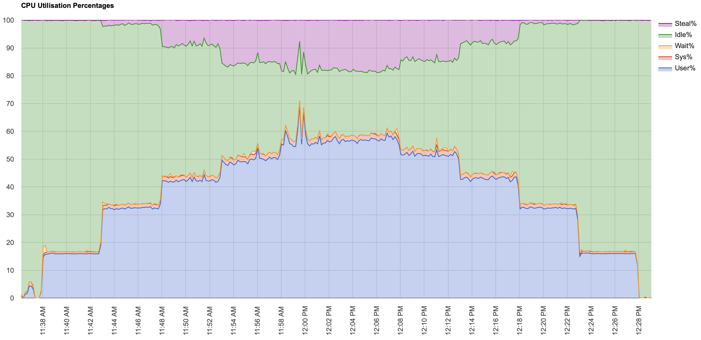

## LinuxONE Chart v1.0
> 用于解析nmon, hyptop, cpumf并生成图形html报告直接在线查看.  
> 该工具处于开发阶段,暂未对外公布.  
> HTML Report Demo地址(IBM内部访问): [http://chart.linuxone.cn/output](http://chart.linuxone.cn/output)  

## 总览

## 基于Hyptop提取的数据
### 指定LPAR的Core使用量(1颗物理IFL=100)

### 指定LPAR的Core MGM使用量(1颗物理IFL=100)

### 指定LPAR的Core Thread使用量(开启SMT2,每颗物理IFL包含2个线程, 1个线程=100)

- - - -

### 整机Core的使用量(1IFL=100)

### 整机Core Thread使用量(开启SMT2,每颗物理IFL包含2个线程, 1个线程=100)

### 整机Core vs Core Thread

- - - -

## 基于CPUMF提取的数据

### CPUMF : L2P L3P L4LP L4RP MEMP

### CPUMF: CPI L1MP

- - - -
## 基于nmon提取的数据
### CPU

### 网络

### 磁盘

