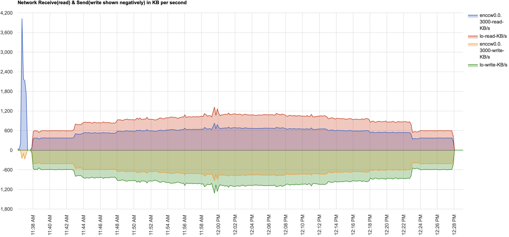
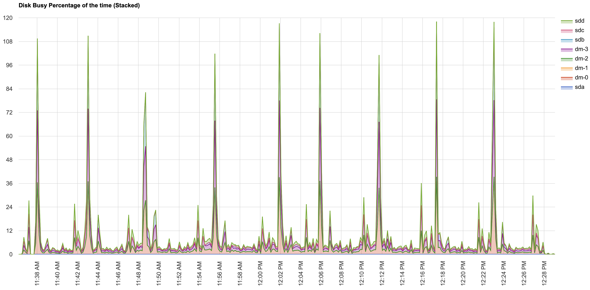

## LinuxONE Chart v1.0
> 该工具用于解析nmon, hyptop, cpumf并生成图形html报告直接在线查看.  

Demo地址(IBM内部访问): http://chart.linuxone.cn/output

### 总览

### 指定LPAR的Hyptop Core使用量(1颗物理IFL=100)

### 指定LPAR的Hyptop MGM使用量(1颗物理IFL=100)

### 指定LPAR的Hyptop Thread使用量(开启SMT2,每颗物理IFL包含2个线程, 1个线程=100)

- - - -

### 整机Core的使用量(1IFL=100)

### 整机Core Thread使用量(开启SMT2,每颗物理IFL包含2个线程, 1个线程=100)

### 整机Core vs Thread

- - - -

### CPUMF : L2P L3P L4LP L4RP MEMP

### CPUMF: CPI L1MP

- - - -
## 其他nmon指标
### 网络

### 磁盘

